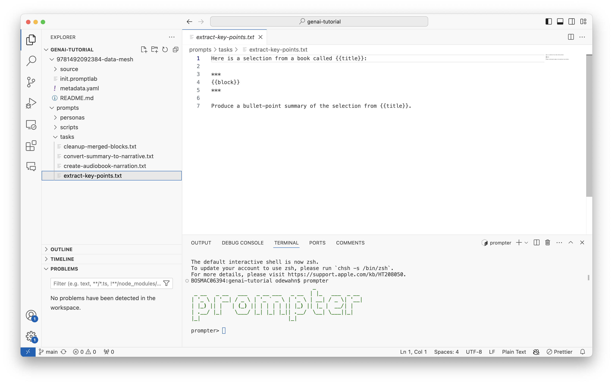

# TO DO

Redo scripts file to assume relative directories
Recompile fetcher to use config file `~/.fetcher`

# Initial Setup

# Set up a working directory

For the purposes of this walkthrough, tlet's assume all files are in a directory called `genai-tutorial`:

```
cd ~
mkdir genai-tutorial
cd genai-tutorial
```

# Install `fetcher` and download some content

fetcher is a tool for downloading content from the learning platform. You provide the content identifier you want to download, and it create a directory based on the identfier and work title, and then downloads the source text into it. You need a JWT to be able to get full content.

Downland fetcher from https://drive.google.com/drive/u/0/folders/15UZ9jfqb9bepiN4uNrSIZnJsiVXjNWX0 and install it.

## Installation

Install fetcher from the shared drive

<link>

You can see the additional capabilities of fetcher at https://github.com/odewahn/fetcher. The following sections walk through the basic steps.

## Startup

Open a terminal

```
cd ~/genai-tutorial
fetcher
```

It will take a minute for fetcher to start...

## Set up authentication

Run the following command

```
auth
```

Tou will be prompted to enter a JWT. If you don't have one, you cn still use fetcher, but you will only get content previews. Note that this will create a configuration file called in your home directory called `.fetcher`. You should keep the content of this file private.

## Pull some content

You pull content using the `init` command:

```
init --identifier=9781492092384
```

Fetcher will create a direcory based on the identifier and title slug, and start downloading the content into it:

```
- 9781492092384-data-mesh
-- README.md
-- metadata.yml
-- source
   -- ...
   -- 00009-ch01-1-data-mesh-in-a-nutshell.html
   -- 00010-ch02-2-principle-of-domain-ownership.html
   -- 00011-ch03-3-principle-of-data-as-a-product.html
   -- 00012-ch04-4-principle-of-the-self-serve-data-platform.html
   -- ...
```

The `metadata.yml` file contains the a subset of the product metadata:

```
authors: Dehghani, Zhamak
content_format: book
description: <marketing description>
duration_seconds: null
format: book
identifier: '9781492092384'
issued: '2022-03-09'
publishers: O'Reilly Media, Inc.
title: Data Mesh
topics: Data Mesh
virtual_pages: 569
```

The `source` directory contains the text of each element in the project. Note that the file type depends on the type of content: books will have `html` data, while courses will be in `markdown` format.

# Prompt Templates

Once you have content downloaded, you can start defining the kinds of prompts you want to perform on it.

Prompts are defined using the [jinja templating language]().

## Setup

You'll need a directory to store the prompt templates and automation scripts. Download this into the root your working direcory:

```
cd ~/genai-tutorial
git clone https://github.com/odewahn/prompts
```

You will then have a directory that looks like this:

```
- prompts
  - tasks
    - extract-key-points.txt
    - ...
  - personas
    - oreilly-short.txt
  - scripts
    - summarizer.jinja
```

Here is a description of the contents for each folder:

## `tasks`

The `tasks` folder contains templates for the common tasks you want an LLM to perform. For example, things like extracting key points, writing a narrative summary, or creating a narrative summary.

For example, here is the contents of the `extract-key-points.txt` task:

```
Here is a selection from a book called {{title}}:

***
{{block}}
***

Produce a bullet-point summary of the selection from {{title}}.
```

The task, as well as any metadata such as `{{title}}` and `{{block}}` elements is supplied to `prompter` as described below. The `{{block}}` element is a special, reserved word and is used to supply a block of text extracted from the content you downloaded from `fetcher`. In general, a chapter (much less an entire book) is far too long to fit within the context window of most models. `prompter` is a tool for helping manage this problem by giving you many ways to break contento into smaller blocks and do prompting with it.

## `personas`

The `personas` directory contains prompts related to the tone of voice and approach the LLM should use when it's performing the task. (This is sometimes also called the system prompt.) For example, you might want than LLM to sound like a helpful tutor, or perhaps a pirate.

Here is the sample of the `oreilly-short.txt` persona:

```
Imagine you are an expert in a technical field, tasked with explaining a complex topic to a smart novice. Whether speaking or writing, your tone should be informal, helpful, and friendly, yet rigorously thorough. Emphasize clarity and engagement, ensuring that your explanation is accessible while maintaining depth. Your goal is to create a seamless experience where concepts take center stage, guiding the audience through the information with organized structure and eliminating unnecessary details. Consider the audience's potential prior knowledge and approach the explanation as if addressing an intelligent novice.
```

You supply the persona as an option to `prompter` as described below.

## `scripts`

prompter provides two ways to work with content: a REPL mode and a script mode. The section below will introduce you through the REPL mode, where you enter commands that are run one step at a time. However, much like a scripting language, you can also store commands in a file and then run them all at once. This enables you to scale the production of content once you've figured out how the original content should be formatted and chunked and decided on your prompts.

Here is a sample script that is included in the `scripts` direcory. Note that a script is also defined using a jinja template, so you can do some basic functions like branching and logic:

```
# This script assumes you used fetcher to download the content
# Before running this script, be sure to use the command
#    cd -dir=<content directory>
#
init

   # Load a book
   load --fn=source/*.html
   transform --transformation="html2md,token-split"
   filter --where="block_tag like '%-ch%'"

   # Loading {{format}}
   load --fn=source/*.md
   transform --transformation="token-split"

# Extract the key points
prompt --task=~/Desktop/prompts/tasks/extract-key-points.txt --persona=~/Desktop/prompts/personas/oreilly-short.txt --global=metadata.yaml
squash --delimiter="\n************** SECTION BREAK *****************\n"
prompt --task=~/Desktop/prompts/tasks/cleanup-merged-blocks.txt --global=metadata.yaml
transfer-prompts --group_tag=cleaned-summaries
prompt --task=~/Desktop/prompts/tasks/convert-summary-to-narrative.txt --persona=~/Desktop/prompts/personas/oreilly-short.txt --global=metadata.yaml
transfer-prompts --group_tag=narrative-summary
dump --dir=.
prompt --task=~/Desktop/prompts/tasks/create-audiobook-narration.txt --persona=~/Desktop/prompts/personas/oreilly-short.txt --global=metadata.yaml
transfer-prompts
dump --dir=. --extension=audio-narration.txt
```

You would run this script with the command:

```
run --fn=prompts/scripts/summarizer.jinja
```

# Prompter

Prompter is a tool for automating the process of applying prompt templates to blocks of content. It provides a REPL that allows you to:

- Load content into a local database (SQLITE)
- Convert the content into a format approriate for use with an LLM
- Break the content into smaller blocks that can fit within the context window of most LLMs (currently 8000 tokens). Most books or courses will be 200,000 tokens or more, so they require som degree of preprocessinf.
- Apply prompt templates (both task and persona) and metadata the blocks and sending them to the LLM for completion
- Store and manage the LLM output

Commands in prompter have a basic syntax that consists of a command name and a set of arguments that follow typical command line format. For example, completing a prompt looks like this:

```
prompt --task=../prompts/tasks/extract-key-points.txt --persona=../prompts/tasks/oreilly-short.txt --global=../metadata.yaml
```

You can find full documentation for prompter at https://github.com/odewahn/prompter.

The following sections assume you have downloaded the content and prompts into a root directory.

## Installation

You can download prompter from https://drive.google.com/drive/u/0/folders/15UZ9jfqb9bepiN4uNrSIZnJsiVXjNWX0 and install it.

Open VS Code on your root directory:

```

cd ~/genai-tutorial
code .

```

Your environment should look something like this:



## Navigating to the content repo

Once prompter starts, type `pwd` to see your current location in the filesystem:

```
prompter> pwd
/Users/odewahn/genai-tutorial
```

Use `ls` to see the contents of the directory:

```
prompter> ls
total 0
drwxr-xr-x  6 odewahn  staff  192 Jun 27 10:56 9781492092384-data-mesh
drwxr-xr-x  6 odewahn  staff  192 Jun 27 10:55 prompts
```

Use `cd --dir=<direcotory>` to change into the directory you downloaded with `fetcher`:

```
prompter> cd --dir=9781492092384-data-mesh
prompter> ls
total 24
-rw-------   1 odewahn  staff   121 Jun 27 10:56 README.md
-rw-------   1 odewahn  staff   285 Jun 27 10:56 init.promptlab
-rw-r--r--   1 odewahn  staff  1500 Jun 27 10:56 metadata.yaml
drwxr-xr-x  35 odewahn  staff  1120 Jun 27 10:58 source
```

Finally, run the `init` command to create the prompter database for this content. In general, the tool assumes one database per content project.

```
prompter> init
[16:53:03] Backing up database to prompter.db.20240627-165303.bak                                                 main.py:401
prompter> ls
total 88
-rw-------   1 odewahn  staff    121 Jun 27 10:56 README.md
-rw-------   1 odewahn  staff    285 Jun 27 10:56 init.promptlab
-rw-r--r--   1 odewahn  staff   1500 Jun 27 10:56 metadata.yaml
-rw-r--r--   1 odewahn  staff  32768 Jun 27 16:53 prompter.db
drwxr-xr-x  35 odewahn  staff   1120 Jun 27 10:58 source
```

Note that you now have a file called `prompter.db`. This is a sqlite database where all content blocks and prompt responses will be stored.
